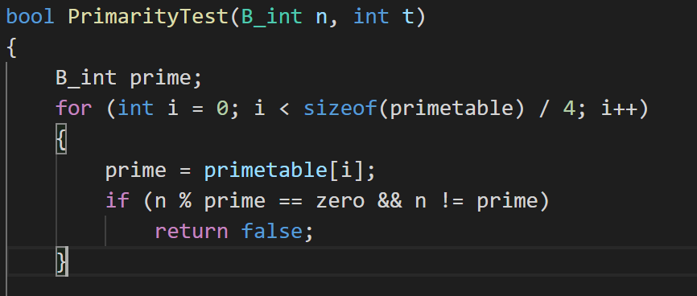
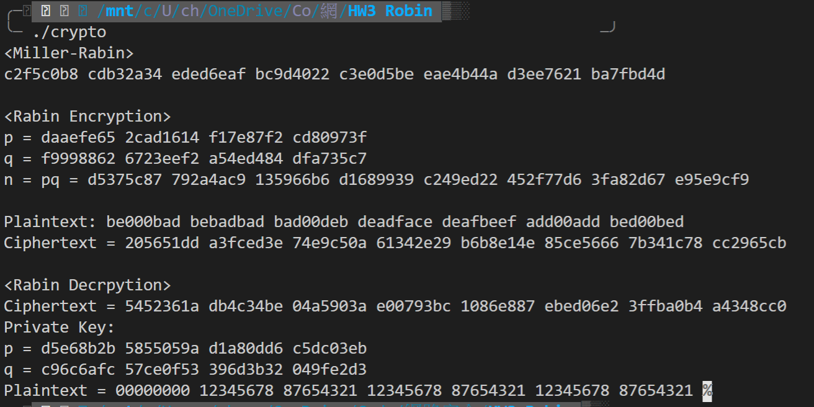
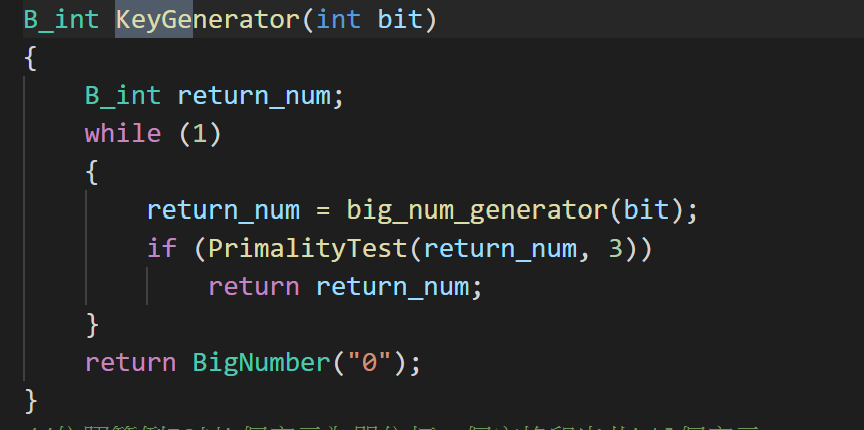
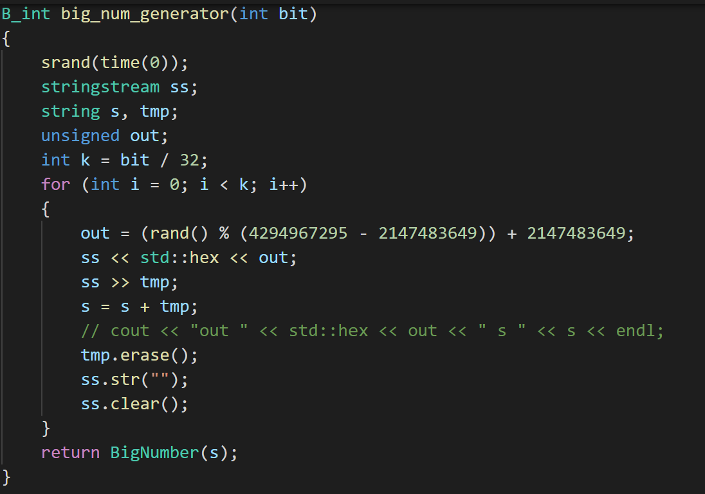

# 網路安全 HW3：Miller-Rabin and crypto system

## 106021226 蔡皓宇

## **使用說明**

共有三個程式

BigNumber.cpp
BigNumber.h

ptest.cpp
ptest.h
ptestdemo.cpp

RabinCrypto.cpp


使用 make指令可直接 compile and run 本次作業主要的IO
若已經compile過，可使用 make run指令
make clean可清除多餘檔案

依照範例格式輸入16進位數字即可進行加密集解密

<*Miller-Rabin*>
的部分將會生成256bit的質數，運行時間稍久，依亂數種子的運氣而定。
有編寫用小於1000的質數測試的部分，可以取消註解來進行加速。

## **Output Result**


## **code 講解**

程式大致上分為兩部分，Primality test，以及Crypto System的實作。
將會依序講解

## **Primality Test**
程式整體與slide中的pseudo code沒什麼差別，直接以C++實做即可，
內容涉及BigNumber，利用第一次作業的code實做，在這次作業過程中發現第一次作業的bug
e.g. 4 / 4 = 0, 4 % 4 = 0
同樣的數字相除以及取於數會等於0，在這次作業中一併修正。
原本的BigNumber code中判斷 a<=b 時就會回傳0，將等號修正掉即可。

並提供以質數表加速的程式，將繳交的程式碼取消註解集可加速。
提供demo檔案進行測試，使用
```
make BigNumber.cpp ptest.cpp ptestdemo -o ptest
./ptest
```
可以使用Primality test，輸入為16進位整數。
若為質數輸出1
若為和數輸出0

## **Miller-Rabin**

範例輸出第一個part的miller-rabin為輸出256bit的質數。
基於上面的primality test，輸出256bit的大整束後不斷測試，測試出質數為止即可。
可設定要輸出多少bit的大質數。
輸出大數的方法，為輸出k/32個32位元亂數在將其合併。


## **Rabin CryptoSystem**

### 各個function講解

這個function用來輸出如範例IO中的每8個字元為一組加空格輸出，只是一些簡單的字串處理。
```c++
//依照範例IO以k個字元為單位打一個空格印出共k*l個字元
void print_for_blank(string text, int k, int l)
```

加密相當的簡單，只要開平方mod n即可
```c++
B_int encyption(B_int ptext, B_int n)
{
    return (ptext * ptext) % n;
}
```

解密涉及較多步驟，依序解釋各個需要用到的function

此為  p = 3 mod 4 計算的平方根，用以計算slide中的r,s
```c++
B_int sqrt_p_3(B_int a, B_int p)
{
    return Power(a, (p + one) / four, p);
}
```
同理，這是 當 p = 5 mod 8 計算的平方根，用以計算slide中的r,s
```c++
B_int sqrt_p_5(B_int a, B_int p)
{
    B_int d;
    B_int neg_1 = p - one;
    d = Power(a, (p - one) / four, p);
    if (d == one)
        return Power(a, (p + three) / eight, p);
    else if (d == neg_1)
        return (two * a * Power(four * a, (p - five) / eight, p)) % p;
    return neg_1;
}
```

用以計算slide中的c,d, where cp+dq = 1
將extend eucild algorithm實作出來即可
```c++
//b<a 
void BezoutIdentity(B_int a, B_int b, B_int &rx, B_int &ry)
{
    B_int x = 0;
    B_int y = 1;
    B_int last_x = 1;
    B_int last_y = 0;
    B_int tmp1, tmp2, tmp3;
    while (b != zero)
    {
        B_int q = a / b;
        tmp1 = a % b;
        a = b;
        b = tmp1;
        tmp2 = x;
        x = last_x - q * x;
        last_x = tmp2;
        tmp3 = y;
        y = last_y - q * y;
        last_y = tmp3;
    }
    rx = last_x;
    ry = last_y;
}
```

於
```c++ 
B_int decyption(B_int ctext, B_int p, B_int q, B_int n)
```
中計算出 r,s,c,d後
即可計算x,y
處理一下正負號後
檢查最後8個字元是否重複，即可判斷哪個為明文，並回傳。
這部分也是簡單的字串處理，省略解釋。
```c++
    x = (r * d * q + s * c * p) % n;
    y = (r * d * q - s * c * p) % n;

    if (x < zero)
        x = -x;
    if (y < zero)
        y = -y;

    if (check_repet(x))
        return x;
    else if (check_repet((-x + n)))
        return (-x + n);
    else if (check_repet(y))
        return y;
    else if (check_repet(-y + n))
        return (-y + n);
```

## **總結**
基於第一次作業，再將講義中的pseudo code時做出來即可，由於第一次的作業有些許bug，除錯時花了一些時間，此外本次作業沒什麼太大的難度。
照著spec依序完成即可。